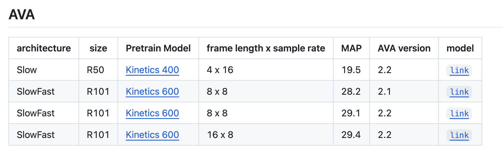
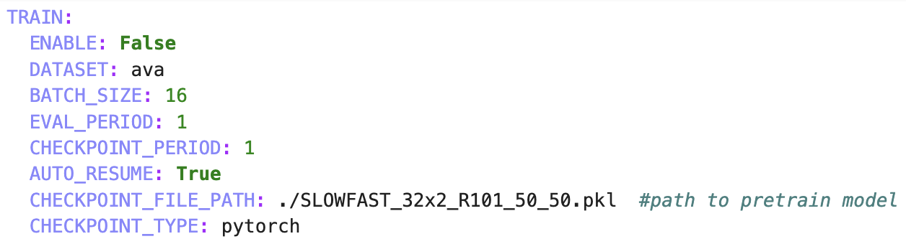
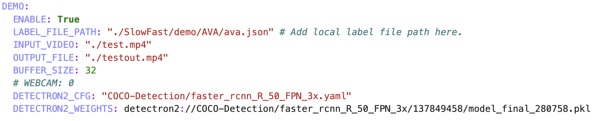
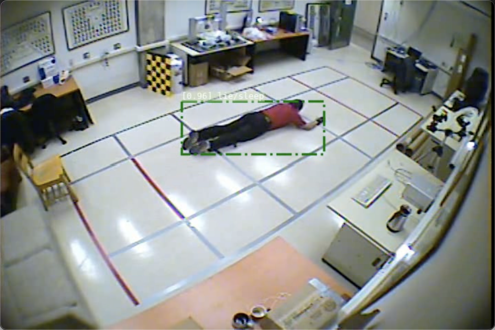
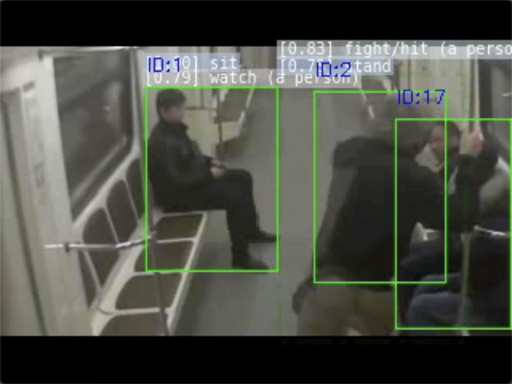

# yolo_slowfast

### introduction

We imply Yolov11 and Deepsort_oh for object detection and object tracking (based on the former project writer did [linked here](https://github.com/J-aso-n/metro-station-passenger-detection.git)), together with SlowFast model (official) for action detection on AVA movement categories.

### Getting Start

my GPU Cuda version is 12.4

My python version is 3.12

we use the official version of SlowFast, so we have to set up the environment of SlowFast first, but follow my following instructions is OK.

1, first we download the official SlowFast from (Thanks to reference No.2)

```
cd yolo_slowfast
git clone https://gitee.com/qiang_sun/SlowFast.git
```

2, then we download the checkpoint file from [official link](https://github.com/facebookresearch/SlowFast/blob/main/MODEL_ZOO.md) or [here](https://drive.google.com/drive/folders/1i0_JOMXHZDPXY3WPU0YQdtUE5iW3kPRH) and put it under root folder

we choose the SLOWFAST_32x2_R101_50_50 model (the third one)



3, we download the file "ava.json" and "SLOWFAST_32x2_R101_50_50.yaml" from [here](https://drive.google.com/drive/folders/1i0_JOMXHZDPXY3WPU0YQdtUE5iW3kPRH) and put them into folder "yolo_slowfast/SlowFast/demo/AVA/"

You may need to change some individual settings like



"CHECKPOINT_FILE_PATH": you may change to your own route



"INPUT_VIDEO" and "OUTPUT_FILE" you may change to your own testing video route

"BUFFER_SIZE" you may also change it which determine the interval of action detection

we also provide some test videos in [here](https://drive.google.com/drive/folders/1i0_JOMXHZDPXY3WPU0YQdtUE5iW3kPRH)

4, then we set up the environment 

```
pip install -r requirements.txt
pip install 'git+https://github.com/facebookresearch/fvcore'
conda install av==14.2.0 -c conda-forge
pip install -U 'git+https://github.com/facebookresearch/fvcore.git' 'git+https://github.com/cocodataset/cocoapi.git#subdirectory=PythonAPI'
git clone https://github.com/facebookresearch/detectron2 detectron2_repo
pip install -e detectron2_repo
```

then

```
export PYTHONPATH=/path/to/SlowFast:$PYTHONPATH
```

Here u should change the "/path/to/" part to your own route

5, at last we run command to start

```
python run.py --cfg SlowFast/demo/AVA/SLOWFAST_32x2_R101_50_50.yaml
```

### Result

fall detection:



fight detection:



### Reference

SlowFast：https://github.com/facebookresearch/SlowFast/tree/main

SlowFast的辛酸复现过程：https://blog.csdn.net/normal_lk/article/details/126138119

### Other

some other problems about Deepsort_oh you can see at [here](https://github.com/J-aso-n/metro-station-passenger-detection.git)
